# olist_cohort_analytics_snowflake

## Project Executive Summary
I deployed this DataAnalytics Environment for the Olist Ecommerce data achieved from Kaggle.

This project includes features below

1. Python script which can create Table from Zip file uploaded to stage manually
2. Visualize the data for cohort analytics with Streamlit

## System Architecture Diagram
※The tables and views are transformed by dbt workflow

```mermaid
graph TD
    A[Kaggle / Olist Compressed Zip] -->|Manual Stage Allocation| B(Snowflake Internal Stage)
    B -->|Encrypted File Stream Access| C[Snowpark Python Engine]
    C -->|In-Memory Chunked Streaming| D[Snowflake Compute Pushdown]
    D -->|High-Throughput Bulk Insertion| E[(Snowflake Database: RAW Layer)]
    
    subgraph GitHub Actions Pipeline
        F[GitHub CI Runner] -->|Asymmetric RSA-2048 Key-Pair Handshake| D
    end

    style B fill:#333,stroke:#29B6F6,stroke-width:2px;
    style D fill:#1A237E,stroke:#29B6F6,stroke-width:2px;
    style E fill:#0D47A1,stroke:#FFF,stroke-width:2px;
```

## Core Engineering Highlights
### FileStream for creating Table from Zip
In the process of creating Table from zipfile in stage, I used filestream to leverage Snowflake machine power. It helps consuming too many credit in compute pool
### Access from Github
This project is based on dbt project, dbt will request the authentication via Github Actions. In the github Actions, I used key-pair authentication. This is known as strict secured auth system by using 2 keys public and private. Other hackers can't decrypt easily by mathematical reason.

## FinOps : 
TODO : make script